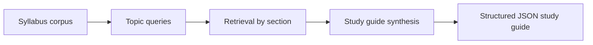

# Syllabus to Study Guide RAG

## PT-BR

### Visão rápida
Este projeto mostra como usar **RAG para transformar syllabus e materiais de curso em um guia de estudos estruturado**. Em vez de responder só perguntas pontuais, o pipeline reorganiza o conteúdo do curso em seções úteis para o estudante: objetivos, plano semanal, entregáveis, estratégia de estudo e foco de avaliação.

### Por que isso faz sentido em EdTech
Em educação, boa parte do atrito do aluno não vem de falta de conteúdo, mas de:
- dificuldade de entender prioridades;
- excesso de informação espalhada em múltiplos documentos;
- incerteza sobre o que estudar primeiro;
- confusão sobre entregas e critérios de avaliação.

Esse projeto endereça isso convertendo documentos acadêmicos em um **study guide grounded**, pronto para interface de produto.

### O que o projeto faz
1. Gera um corpus local com syllabus, calendário, FAQ, rubric e assignment guide.
2. Define perguntas-guia por tópico.
3. Recupera as melhores evidências para cada tópico.
4. Monta um guia de estudos estruturado em seções.
5. Gera checklist final de preparação.
6. Exporta o resultado em `JSON`.

### Arquitetura conceitual


### Estrutura do repositório
- [src/sample_data.py](/Users/flaviagaia/Documents/CV_FLAVIA_CODEX/-syllabus-to-study-guide-rag/src/sample_data.py)
  Gera o corpus educacional local.
- [src/retrieval.py](/Users/flaviagaia/Documents/CV_FLAVIA_CODEX/-syllabus-to-study-guide-rag/src/retrieval.py)
  Recupera evidências por tópico usando `TF-IDF + cosine similarity`.
- [src/generation.py](/Users/flaviagaia/Documents/CV_FLAVIA_CODEX/-syllabus-to-study-guide-rag/src/generation.py)
  Monta o guia de estudos com seções e checklist.
- [src/pipeline.py](/Users/flaviagaia/Documents/CV_FLAVIA_CODEX/-syllabus-to-study-guide-rag/src/pipeline.py)
  Orquestra o run ponta a ponta.
- [tests/test_project.py](/Users/flaviagaia/Documents/CV_FLAVIA_CODEX/-syllabus-to-study-guide-rag/tests/test_project.py)
  Valida o contrato do projeto.

### Corpus educacional
O corpus simula um conjunto típico de documentos usados em plataformas educacionais:
- syllabus;
- course calendar;
- assignment guide;
- reading notes;
- rubric;
- FAQ;
- capstone brief;
- office hours policy.

### Técnicas utilizadas
#### 1. Retrieval por intenção
Em vez de só receber uma pergunta do usuário, o pipeline define **topic queries** para partes importantes do guia:
- `course_objectives`
- `weekly_plan`
- `deliverables`
- `study_strategy`
- `evaluation_focus`

Isso mostra uma estrutura muito útil para produtos educacionais: não só responder perguntas, mas **organizar conhecimento**.

#### 2. RAG orientado a template
O projeto não usa geração livre. Ele cria uma estrutura previsível de estudo:
- seção
- resumo grounded
- fonte principal
- checklist final

Essa abordagem é boa para:
- UX consistente;
- testabilidade;
- integração com front-end;
- redução de hallucination.

#### 3. Saída estruturada
O pipeline gera:
- [study_guide_report.json](/Users/flaviagaia/Documents/CV_FLAVIA_CODEX/-syllabus-to-study-guide-rag/data/processed/study_guide_report.json)

Campos principais:
- `title`
- `sections`
- `study_checklist`
- `source_count`
- `limitation_note`

Essa estrutura é boa para produto porque o guia pode ser renderizado diretamente em:
- página de curso;
- onboarding do aluno;
- painel de revisão;
- experiência de estudo contextual.

### Resultado atual
- `dataset_source = syllabus_study_guide_local_sample`
- `document_count = 8`
- `section_count = 5`
- `checklist_item_count = 5`
- `top_section_source = SG-1001`

### Como executar
```bash
python3 main.py
python3 -m unittest discover -s tests -v
```

### Do básico ao avançado
No nível básico, este projeto é um pipeline de retrieval + organização de conteúdo.

No nível intermediário, ele é um **RAG estruturado para study guide generation**.

No nível avançado, ele permite discutir:
- retrieval orientado a tópicos;
- geração estruturada para produto educacional;
- grounding por seção;
- integração com UX de estudo;
- evolução para embeddings, reranking e agentes.

### Como defender este projeto em entrevista
- ele mostra um caso real de EdTech, não só chatbot genérico;
- transforma documentos dispersos em uma experiência útil ao estudante;
- usa RAG de forma controlada e testável;
- deixa clara a ponte entre ciência de dados, backend e experiência de produto.

### Arquitetura alvo em produção
Uma evolução natural seria:
- ingestão automática de syllabus e conteúdo do LMS;
- versionamento por curso e semestre;
- retrieval híbrido por tópico;
- geração estruturada com template persistente;
- exposição via API para front-end educacional.

## EN

### Quick overview
This project uses **RAG to convert syllabus materials into a structured study guide**. Instead of only answering isolated questions, it reorganizes course content into useful sections such as objectives, weekly plan, deliverables, study strategy, and evaluation focus.

### What the project does
1. Builds a local syllabus corpus.
2. Defines topic-level retrieval queries.
3. Retrieves the best evidence for each topic.
4. Builds a structured study guide.
5. Adds a study checklist.
6. Exports the final guide as `JSON`.

### Output contract
The project exports:
- [study_guide_report.json](/Users/flaviagaia/Documents/CV_FLAVIA_CODEX/-syllabus-to-study-guide-rag/data/processed/study_guide_report.json)

Main fields:
- `title`
- `sections`
- `study_checklist`
- `source_count`
- `limitation_note`

This makes the output immediately usable by product surfaces such as onboarding pages, course dashboards, or contextual study panels.

### Current result
- `dataset_source = syllabus_study_guide_local_sample`
- `document_count = 8`
- `section_count = 5`
- `checklist_item_count = 5`
- `top_section_source = SG-1001`

### Run locally
```bash
python3 main.py
python3 -m unittest discover -s tests -v
```

### Advanced discussion points
This repository is useful to discuss:
- topic-guided retrieval;
- structured educational RAG outputs;
- grounded study-guide generation;
- product-oriented content orchestration for EdTech.
